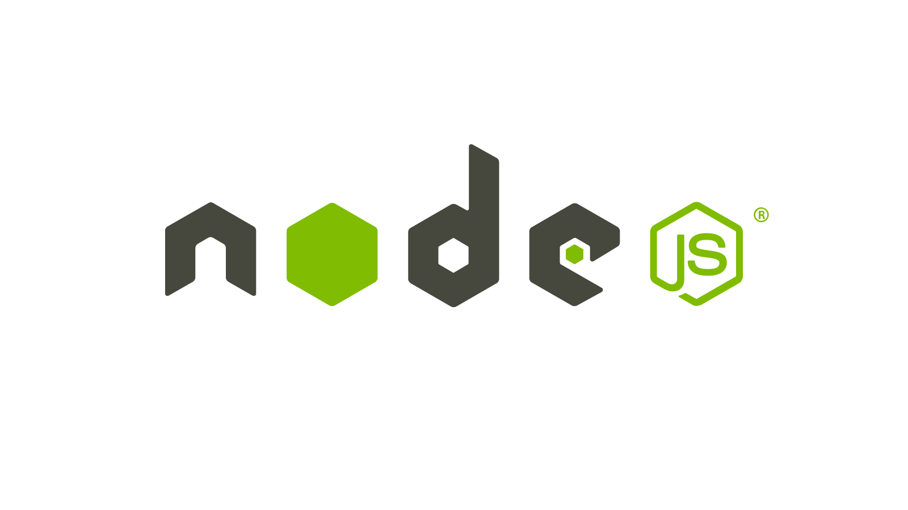
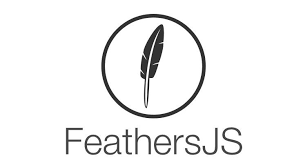

# Data-Pixel | Dashboard


https://github.com/lerna/lerna/tree/master/commands/add#readme


## **Project Goal:**

---

The purpose of this project is to make an interactive dashboard which translates the sensordata of the Intelliflow Hardware team to an easy-to-use and clear view over the data of multiple sensors from multiple sources.

&nbsp;

## **Project Explanation:**

---

The purpose of this project is to make an interactive dashboard which translates the sensordata of the Intelliflow Hardware team to an easy-to-use and clear view over the data of multiple sensors from multiple sources.

&nbsp;

## **Explanation of all used technologies:**

---

### **Front-End:**

[Node.js](https://nodejs.org/en/) - This is an open-source and multiplatform Javascript-runtime-environment where JavaScript can be executed outside a browser.

With Node.js developers can make use of JaveScript for command-line-tools and server-side-programming.

[](NodeJs)

&nbsp;

[ApexChart](https://apexcharts.com/) - ApexCharts is a free and open-source modern charting library that helps developers to create beautiful and interactive visualizations for web pages. It is an open-source project licensed under MIT and is free to use in commercial applications.

[](ApexCharts)

&nbsp;

### **Back-End:**

[Feathers](https://feathersjs.com/) -
Feathers is a lightweight web-framework for creating real-time applications and REST APIs using JavaScript or TypeScript.

Feathers can interact with any backend technology, supports over a dozen databases and works with any frontend technology like React, VueJS, Angular, React Native, Android or iOS.

[](Feathers)
&nbsp;

## **Required Tools:**

---

Node.JS - https://nodejs.org/en/

## **Recommended Tools:**

---

Insomnia - https://insomnia.rest/

## **Installation:**

---

## Vue Project

```
npm install @vue/cli -g
vue create .
    Manually pick features:
        1 - CSS Pre-Processor
        2 - Router
        3 - Linting / Formatting
        4 - Select vue version
        5 - Babel
        6 - TypeScript
    Vue 2
    Yes (Class Style)
    Yes
    Dart Sass
    ESLint + AirBNB
    Lint on Save
    Dedicated Config file
```

## Yarn

```
yarn install
```

## Vuetify

```
vue add vuetify
    - Advanced
    - Yes
    - No
    - No
    - Material Design Icons
    - Yes
    - Yes
    - English
```

## **ToDo:**

-   [ ] Finish my changes
-   [ ] Push my commits to GitHub
-   [ ] Open a pull request
