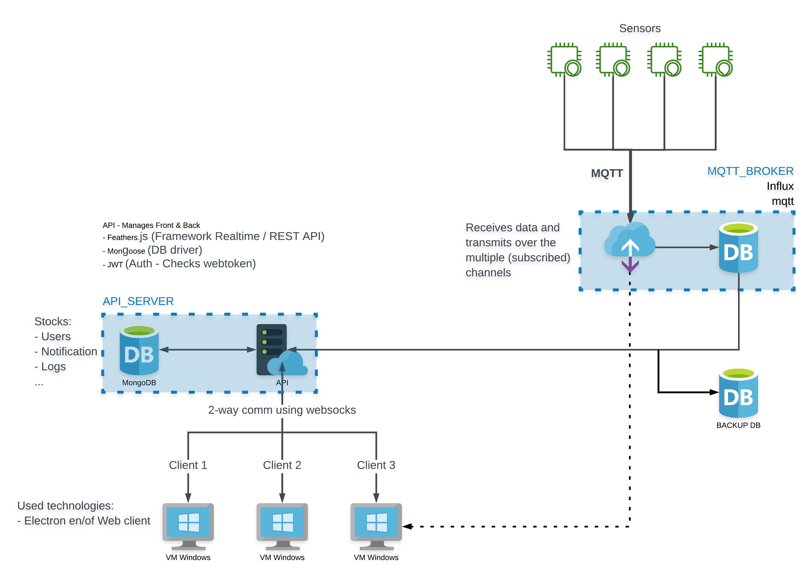

# Setup

Documentation ...

## Architecture

<p align="center">
  <a href="https://github.com/JensVanhulst/data-pixel" target="_blank" rel="noopener noreferrer">
    
  </a>
</p>

### Used ports

| Port  | process           |
| ----- | ----------------- |
| 1883  | mqtt broker       |
| 28015 | rethink db        |
| 3030  | API               |
| 8080  | Web application   |
| 8081  | Documentation     |
| 8082  | Rethink dashboard |
| 5000  | Portainer         |

## How to setup the server

<!-- TODO: guides for easily setup via cloud provider -->

> There are multipe ways to setup a server. For example you can use digitalocean, amazon aws to quickly setup your server. This guide will show you how to setup a server localy.

### Operating system

Choose a linux operating system. In this example we will use centOS 7 which can be download from [here][1]. You can follow this [guide][2] to setup the OS.

[1]: [https://www.centos.org/centos-linux/]

[2]: [https://phoenixnap.com/kb/how-to-install-centos-7]

### Install node.js runtime

Download nvm source files

::: warning
Always check the version number of nvm. In this case we install nvm version **_0.25.0_**
:::

```sh
curl https://raw.githubusercontent.com/creationix/nvm/v0.25.0/install.sh | bash

# output
Close and reopen your terminal to start using nvm
```

Either do as the output suggests, and close and reopen your terminal session, or run the following command:

```sh
source ~/.bashrc
```

Verify version

```sh
nvm --version

# output
0.25.0
```

Install node with nvm

```sh
nvm install v14.13.0
```

Nvm will automatically detect the selected version.

### Install docker engine

Install the `yum-utils` package (which provides the yum-config-manager utility) and set up the stable repository.

```sh
sudo yum install -y yum-utils

sudo yum-config-manager --add-repo https://download.docker.com/linux/centos/docker-ce.repo
```

Install the docker engine

```sh
sudo yum install docker-ce docker-ce-cli containerd.io
```

Start the docker engine

```sh
sudo systemctl start docker
```

### Install docker-compose

::: warning
Always check the version number of nvm. In this case we install nvm version **_0.25.0_**
:::

```sh
sudo curl -L "https://github.com/docker/compose/releases/download/1.27.4/docker-compose-$(uname -s)-$(uname -m)" -o /usr/local/bin/docker-compose
```

Apply excecutable permissions

```sh
sudo chmod +x /usr/local/bin/docker-compose

sudo ln -s /usr/local/bin/docker-compose /usr/bin/docker-compose
```

Test the installation

```sh
docker-compose --version

#output
docker-compose version 1.27.4, build 1110ad01
```

## How to setup the broker

-   Upload the docker compose file

If you want, you can change the config of the broker by mounting a new config file.

```json
// DEFAULT CONFIG
{
    "host": "localhost",
    "port": 1883,
    "backupPort": 1885,
    "rethink": {
        "hostname": "localhost",
        "port": 28015,
        "tables": ["sensors", "users"]
    }
}
```

To start the docker container run :

```sh
docker-compose up
```

By running this command docker will pull all images and start the broker

## How to setup the API

### Stand alone

#### Docker

Download the docker image

```sh
 docker pull docker.pkg.github.com/pxldigital/3eai-pem-2021-data-pixel/datapixel.broker:latest
```

Run container

```sh
docker container run -p 3030:3030 datapixel.broker:latest
```

### Grouped
